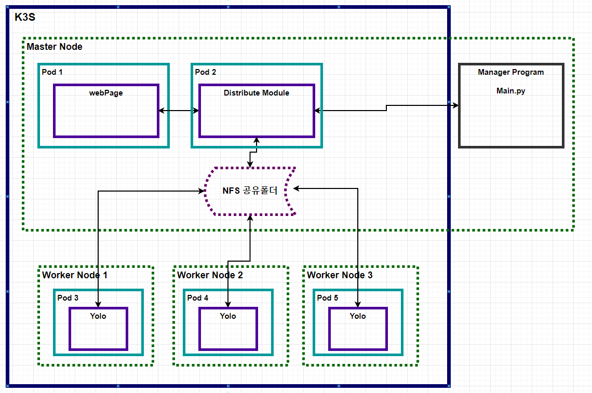
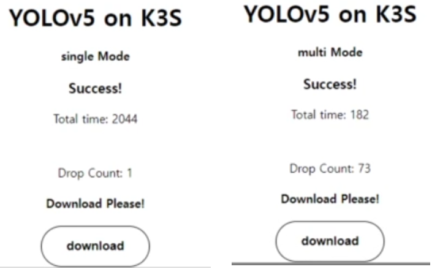
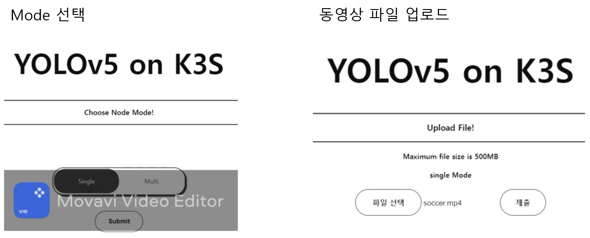
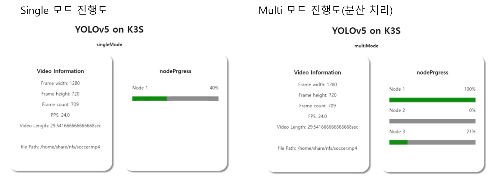

<H1> 쿠버네티스를 활용한 AI모델 분산처리 시스템</H1>
쿠버네티스를 사용해서 영상처리에 대한 분산처리 시스템을 만들었습니다.

<H2> 환경 </H2>

Master : rasberri pi 3 
 
Node 1 : rasberri pi 4

Node 2 : Jetson Nano 4GB

Node 3 : Jetson Nano 4GB

<H2> Usage </H2>

<H3> All node must linked with one router </H3>

Master : main.py, dlskawo0409/spring_test:v18, jaehyuk00/distributed_flask:v105, 

rasberri Pi Worker : dlskawo0409/capston:v30

Jetson Worker : dlskawo0409/gpu:v13 

<H3> must install </H3>

docker

K3s

<H3> Use GPU in Kubernetes</H3>

use arm K3s gpu daemon file

<H2>Result</H2>

